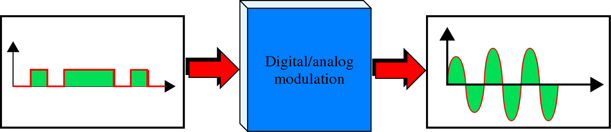
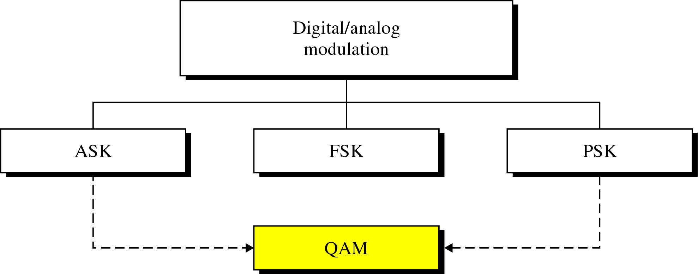
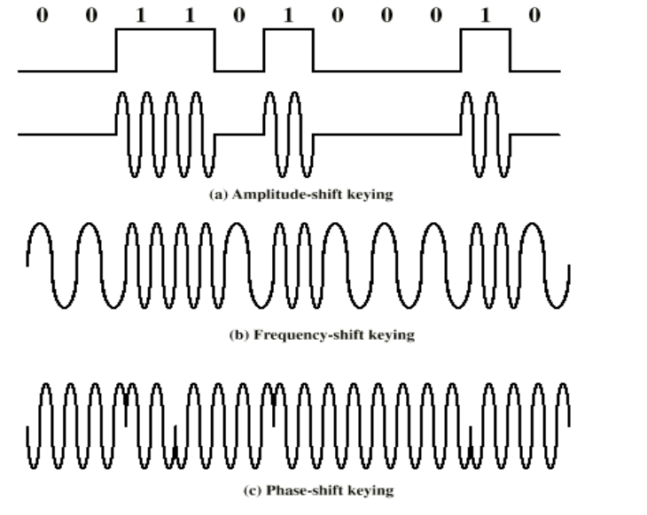
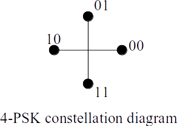
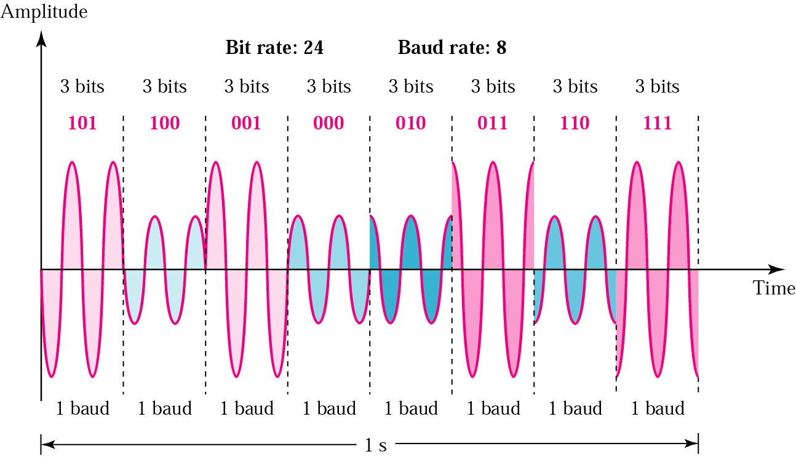
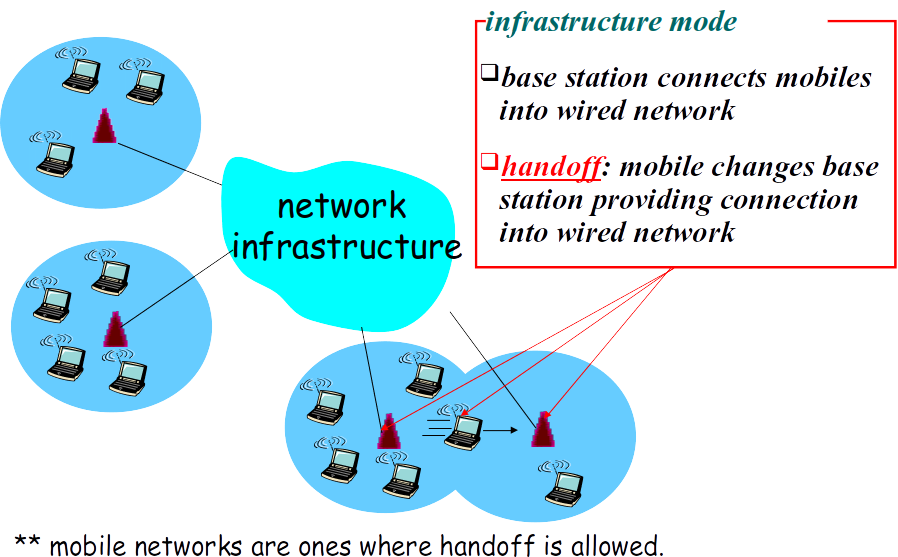
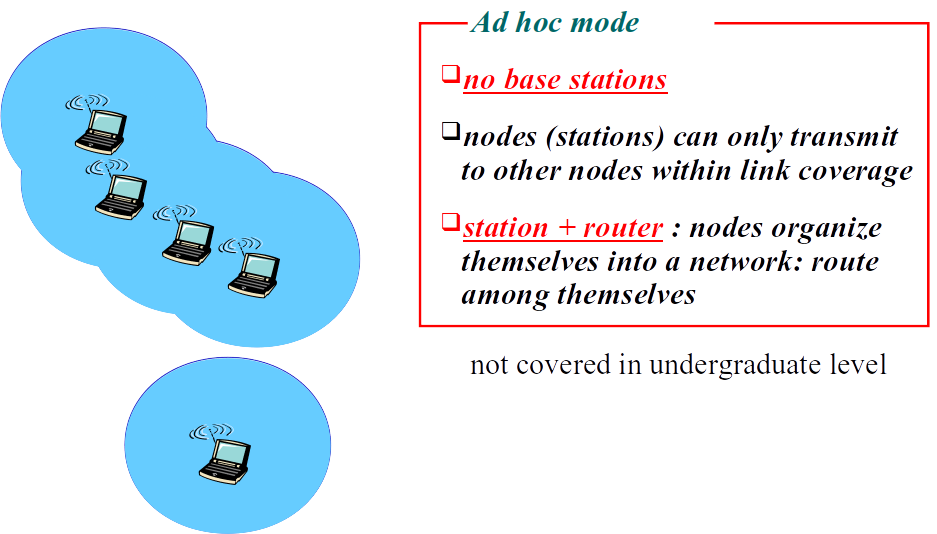
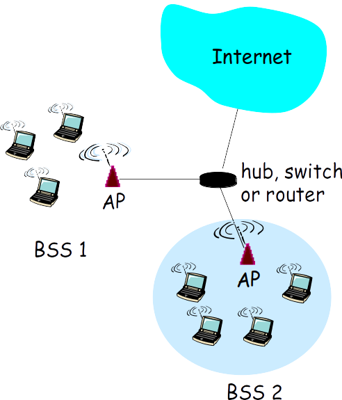
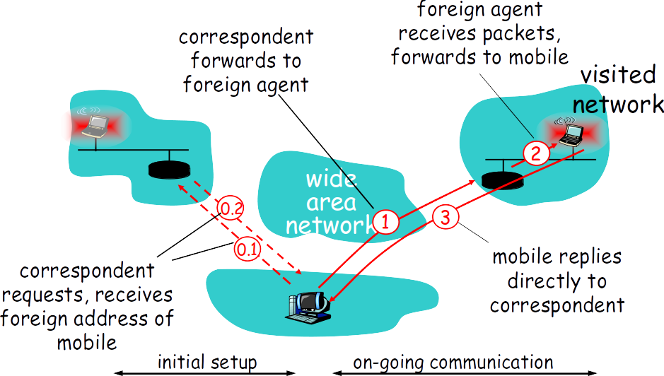
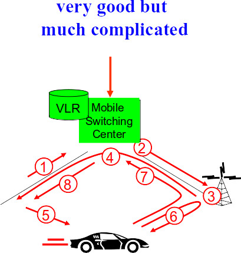

# 데이터 통신과 네트워크

## 물리 계층 및 무선

### 기본 개념

#### 전송 매체

- 안내 매체 (링크라고도 함)
- 안내되지 않은 매체 (무선이라고 함)

### 전송 장애

- 왜곡: 링크를 통해 전파되는 원래 신호 정지

#### 신호 왜곡 요인

- 감쇠 : 전력 감소
- 분산 : 힘의 산란
- 소음 : 원하지 않는 고주파 신호의 침입

#### 감쇠

- 정의 : 신호 강도가 거리에 따라 떨어짐
- 전송 중에 고주파 신호가 감소하기 쉽다
- 매체에 의존
  - 주된 이유는 전기 전송에서 전자기 간섭(EMI)

#### 수신 된 신호를 올바르게 수신하려면

- 감지하기에 충분히 커야한다
- 오류없이 수신 할 수있는 잡음보다 충분히 높아야 한다
  - S / N : 신호 대 잡음비

#### (지연) 왜곡

- 전파 지연 속도는 주파수에 따라 다르다
  - 고주파수는 천천히 움직인다

#### 소음

- 정의 : 송신기와 수신기 사이의 링크에 외부에서 삽입 된 신호
- 소음 유형 (읽기)
  - 열 잡음 : 전자의 열 교반으로 인한
  - 상호 변조 잡음
    - 신호 f1과 f2를 링크에 믹싱 할 때 (f1 + f2) 또는 (f1-f2)의 노이즈가 발생할 수 있음
  - 누화 (Crosstalk) : 근처의 다른 선에서 오는 신호
    - 임펄스 : 짧은 지속 시간과 높은 진폭의 불규칙한 펄스 또는 스파이크
      예 : 외부의 전자기 간섭 (EMI) 또는 정전기

### 디지털-디지털 변환

#### 인코딩의 기본 요구 사항

- 신호를 빠르고 안전하게 수신
- 간단한 인코딩 규칙 :
  - 기술 발전으로 인해 규칙은 덜 중요해짐
  - 즉, 복잡하지만 효율적인 인코딩을 선호
- DC 구성 요소 없음 (또는 고정) (DC : 신호의 평균값)
- 쉬운 동기화
- 고효율 (신호 속도 ≈ 데이터 속도)

#### DC 성분 없음 (또는 고정) (DC : 신호의 평균값)

- 수신자는 디코딩을 위해 발신자의 접지 수준(DC0)을 알아야 한다
- 수신자가 멀리 떨어져 있으면 동일한 접지 수준(DC0)을 유지할 수 없다
- 대신 수신기는 DC0 대신 평균값 (AC0)을 사용합니다.
- 인코딩 규칙이 DC 값을 보장하지 않으면 항상 AC0 === DC0입니다.
- 그러면 수신기는 DC0을 쉽게 찾아서 수신 된 신호를 안전하게 디코딩한다

#### 쉬운 동기화

- 샘플링 주기와 위상을 동기화하기 위한 최신 전송에는 두 가지 유형의 전송, 즉 비동기 전송과 동기 전송이 있다
  - 비동기 전송 : 발신자는 보다 빠르고 정확한 클록 인 독립 클록을 사용합니다. 수신기는 로컬 클록을 사용하여 샘플링주기와 위상을 찾는다.
  - 동기 전송 : 발신자가 전송할 때 데이터, 클럭 (주기 및 위상)을 포함한다.
- 어떻게합니까? : 가능한 빨리 레벨을 변경.
- ** 추가 레벨 또는 추가 샘플링 간격을 가짐으로써 DC 값을 0으로 만들 뿐 만 아니라 레벨을 변경할 수 있다

#### bi-phase 코드의 단점

- 저효율 (50 %)

#### bi-phase 코드의 장점

- 손쉬운 자체 클럭킹 : 모든 중간 비트 전환시 동기화
- DC 부품 없음
- 쉬운 오류 감지 :
  - 전송 오류의 경우 예상되는 전환이 빨리 사라지므로 수신기는 곧 오류를 알 수 있습니다.

#### 맨체스터(Manchester) 코딩 방식

**오늘날 맨체스터 코딩은 데이터 저장과 디지털 데이터 통신 두 분야에서 넓고 다양한 어플리케이션의 역할을 한다.**

무선통신 모듈을 사용할 일이 있어서 보다가 맨체스터 코드를 알게 되었다.이는 디지털 enconde의 형태로서 물리계층(?)에서 신호전송시 사용되는 방법이라고 한다.아래 그림에서 보는 거와 같이 신호 하나의 bit와 순간clock(각각의 High, Low 포함)을 XOR하여 encode한 방법이다.Data와 Clock 신호를 하나의 bit열로 결합하여 전송하는 방식인 것이다.즉, 수신측의 Data만 보았을 때 clock이 필요하지 않다는 이야기다.

**맨체스터 방식에서 각각의 비트는 고정된 시간 혹은 주기에 맞게 전송됩니다.  1은 로(Low)에서 하이(High)로 전환(Transition)되어 표현되고, 0은 하이(High)에서 로(Low)로 전환되어 표현됩니다(효율 50%).** 

### 디지털-아날로그 변환

#### 조정

- (아날로그 신호에 대한 디지털 데이터 인코딩) 변조를 호출

#### 왜 변조가 필요합니까? : 장거리 구리 네트워크에서 디지털 신호를 사용할 수 없음

- 널리 사용되는 전송 매체는 공기, 전자기(구리), 빛이다.
- 구리는 고주파 신호를 쉽게 전송할 수 없다.
- 다른 매체는 쉽게 고주파 신호를 보낼 수 있다.
- 불행하게도, 디지털 신호는 전송주기에서 예리한 형태를 가지므로 고주파가 많이 포함됩니다.

#### 디지털-아날로그 변환 유형

#### 용어

- 비트 전송률 = (전송 된 비트 수) / (단위 시간)
- 전송 속도 = (전송 된 신호 단위 수) / (단위 시간)

#### 변조 기술

#### 선호도: PSK > ASK > FSK

- 왜 FSK를 사용하지 않습니까? Freq. 밴드 문제
  - FSK는 유사한 전송 속도 (대역폭)를 달성하기 위해 PSK 또는 ASK보다 더 많은 주파수 (대역폭)가 필요
  - FSK는 더 많은 주파수 대역을 소비하여 전송 속도를 얻는다
  - Freq. 대역은 매우 제한적이거나 값 비싼 (가치있는) 자원.
- 우리는 왜 ASK를 선호하지 않습니까? 감쇠 문제
  - ASK는 감쇠에 의존하지만 PSK는 그렇지 않습니다.

#### QAM (Quadrature Amplitude Modulation: 직교 진폭 변조)

- ASK와 PSK의 조합.
- 별자리 다이어그램
  - ASK와 PSK 및 해당 비트가 좌표에 할당되는 방법을 보여줍니다 (좌표)
  - 극좌표로 그려 짐 (r, θ)
    - r (반지름) : ASK의 진폭
    - θ (단계) : PSK의 단계

#### 예시

- 1 baud의 시작 지점의 sin함수의 위치가 θ 폭이 r로 계산

### 무선 네트워크의 종류

#### 인프라 모드

- 기지국은 모바일을 유선 네트워크에 연결
- 핸드 오프 : 유선 네트워크에 연결을 제공하는 모바일 변경 기지국

#### 애드혹 모드

- 기지국 없음
- 노드 (스테이션)는 링크 범위 내의 다른 노드로만 전송할 수 있다
- 스테이션 + 라우터 : 노드가 네트워크로 구성

#### 유선 링크와의 차이점…

- 신호 강도 감소 : 무선 신호가 물질을 통해 전파 될 때 감쇠 (경로 손실) : 1 / dk, 4 <k <5
- 다른 소스로부터의 간섭 : 다른 장치 (예 : 전화)가 공유하는 표준화 된 무선 네트워크 주파수 (예 : 2.4GHz); 장치 (모터)도 간섭
- 다중 경로 전파 : 무선 신호가 지상에 반사되어 약간 다른 시간에 광고 목적지에 도착
- 무선 링크를 통한 통신은 어려움

### 802.11 무선 LAN

#### 무선 호스트가 기지국과 통신

- 기지국 = 액세스 포인트 (AP)

#### 인프라 모드의 기본 서비스 세트 (BSS) (일명 "셀")에 포함되는 것

- 무선 호스트
- 액세스 포인트 (AP) : 기지국
- 애드혹 모드 : 호스트 만

### 모바일 IP

### 셀룰러 네트워크 (핸드 오프 절차)

1. 이전 BSS는 MSC에 임박한 핸드 오프를 알리고 1 개 이상의 새로운 BSS 목록을 제공
2. MSC는 새로운 BSS 로의 경로를 설정 (자원 할당)
3. 새로운 BSS는 모바일에서 사용하기 위해 라디오 채널을 할당
4. 새로운 BSS는 MSC를 통해 기존 BSS에“새로운 BSS 준비 완료”신호를 보냄
5. 오래된 BSS는 새로운 BSS에 모바일 핸드 오프를 주문
6. 새로운 채널을 활성화하는 모바일, 새로운 BSS 신호
7. 새로운 BSS를 통한 MSC 로의 모바일 신호 : 핸드 오프 완료. MSC는 통화를 다시 라우팅
8. MSC, 이전 BSS가 자원을 공개