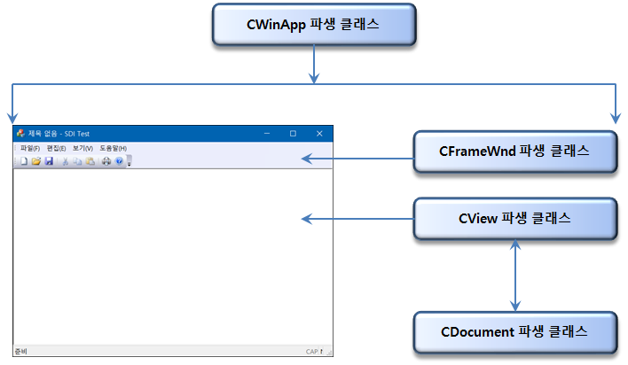
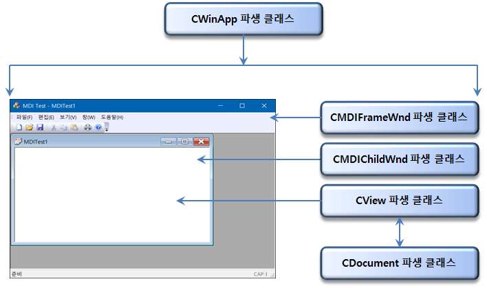
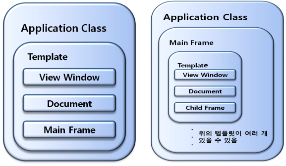
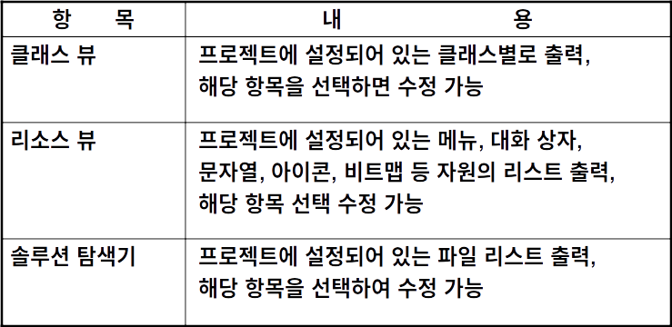
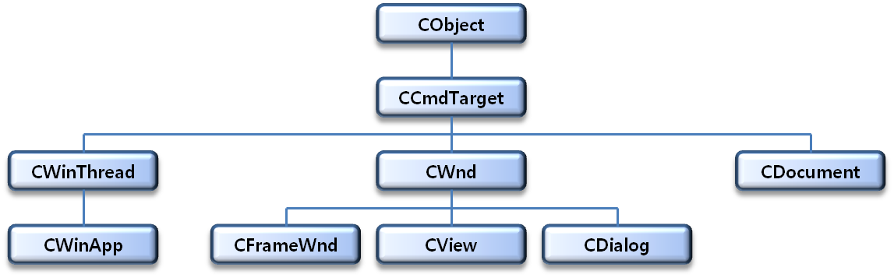
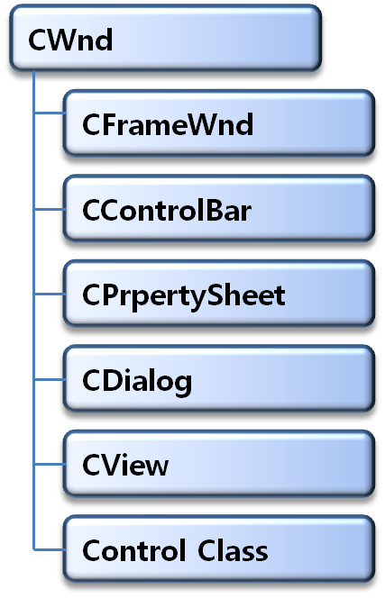
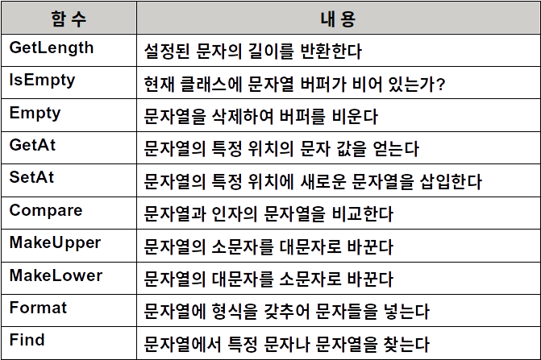

# Visual C++ 2015 MFC Programming

## MFC 개요 및 아키텍쳐

### MFC

- 윈도우 애플리케이션을 생성하기 위해 만들어진 C++ 클래스 라이브러리
- 애플리케이션 프레임워크를 제공


### MFC의 이점

- 윈도우 프로그램 전문가로 만들어 준다.
- 개발시간을 단축시키고, 이식성이 강한 코드를 작성
- ActiveX, OLE, 인터넷 프로그래밍 같은 기술 지원
- 응용 프로그램(데이터베이스, 네트워크)을 손쉽게 작성
- 강력한 사용자 인터페이스를 지원


### MFC의 표기법

- 헝가리안 표기법을 사용한다.
- 클래스는 모두 C로 시작한다.
- 여러 단어가 하나의 클래스 이름일 경우 각 단어별로 첫 글자를 대문자로 표기한다.
- 멤버 변수는 m_로 시작하고, 멤버 함수는 대문자로 시작한다.
- 전역 함수는 Afx라는 접두어가 붙는다.
  - Afx는 Application Framework의 약자로 Microsoft사에서 MFC를 개발했던 팀의 이름이다.


### SDI 애플리케이션의 구조




### SDI 애플리케이션의 구조

- Template :
  -  윈도우로 출력되는 형태
- Main Frame : 
  - 윈도우 외곽 경계를 담당하고 
  - 메뉴, 툴바, 상태바를 가지고 있음
- View 윈도 :
  - 실제 화면 처리를 담당
  - 문자 출력, 그래픽 출력 등
- Document : 
  - 디스크에서 데이터를 읽고 저장


### MDI 애플리케이션의 구조




### MDI 애플리케이션의 구조

- 여러 개의 SDI형태 프로그램
- Main Frame
  - 독립적으로 설정되어 있고 그 안에 template 
- Template
  - Child Frame
  - View Window
  - Document


### MFC 형태의 프로그램 구조

- Application Class
  - MFC프로그램은 템플릿을 포함하고 한 개의 인스턴스를 포함하는 Application class가 있음




### Visual C++의 특징

- 다양한 SDK 형태의 라이브러리를 제공한다
  - Window환경에 맞는 C 언어용 표준 라이브러리
- 강력한 MFC가 있다
  - SDK를 이용하여 클래스를 만들 때의 문제점을 해결
  - 클래스 라이브러리
- 강력한 마법사가 있다
  - 단순히 반복적인 코딩을 자동으로 생성
  - 클래스 마법사, 응용프로그램 마법사, Resource Editor ...


### MFC 응용 프로그램 마법사 익히기

- 프로젝트를 만들 때 실행되는 프로그램
  - 단순히 마우스 버튼으로 몇 개의 항목을 설정하면 자동적으로 프로젝트를 만들어 주고 자동 코딩을 해주는 기능	
  - 자동으로 소스를 만들어 주는 프로그램?
  - 기존의 소스를 단순하게 복사하여 코딩 하는 프로그램?
  - 기존의 있는 클래스를 상속 받는 또 하나의 클래스를 생성?


#### 응용프로그램 종류 단계

- 프로그램의 형태 선택
  - 단일 문서
  - 다중 문서
  - 대화상자 기반
- 문서/뷰 아키텍처
- SDL 검사
- 프로젝트 스타일
- 비주얼 스타일 및 색
- MFC 사용


#### 복합문서 지원 단계

- OLE  옵션 설정
  - OLE항목의 사용여부
  - 객체 삽입 항목을 가지고 있는지 
  - 객체 삽입 항목에서만 구동 되는지
  - 독립적 형태로 구동 되면서 OLE를 지원하여 객체 삽입 항목에서도 구동 되는지
  - 자신도 객체 삽입 항목에서 구동 되는지

- 개체 삽입의 예
  - 프로그램 실행 후 개체 삽입을 선택 했을 경우
  - 자신의 프로그램에 개체삽입을 제공하는 다른 프로그램을 삽입 하여 구동


#### 문서 템플릿 속성 단계

- 파일 확장명
- 필터 이름
- 주 프레임 캡션
- 파일 형식 ID
- 문서 형식 이름
- 파일형식의 긴 이름
- 파일의 새 약식 이름


#### 데이터베이스지원 단계

- 데이터 베이스 사용유무
- 헤더 파일만 포함
- Open, Save등의 항목 없이 데이터베이스 사용
- File 항목을 지원 하면서 데이터베이스 사용


#### 사용자인터페이스 기능 단계

- 윈도 출력 형태 설정
  - 주 프레임 스타일
  - 자식 프레임 스타일
    - 툴바의 형태
    - 클래식 메뉴
    - 메뉴 모음 및 도구 모음
    - 리본


#### 고급기능 단계

- Active X 옵션 설정
  - ActiveX 컨트롤을 자신의 프로그램에 삽입 시킬 수 있는지.
- 인쇄 기능
- 윈도우 소켓
- 자동화
- 다시 시작 관리자 지원


#### 생성된 클래스 단계

- Class 와 파일 대한 정보 및 수정
  - Class 이름은 모든 class에서 변경할 수 있다.
  - Source file과 Header file 이름은 App class 외에 다른 class 에서만 변경할 수 있다
  - Base class이름은 View class 에서만 변경할 수 있다.


#### MDI형 프로젝트 만들기

- SDI 프로젝트 생성과 동일하고 Step 1에서 MDI를 선택
- 추가된 내용 
  - CChildFrame 만이 추가 되었다
  - Child Frame class는 Base Class 이름만 변경할 수 없다.


#### 응용 프로그램 마법사 기능

- 만들고자 하는 기본적인 프로젝트를 생성 해주고 그 안에  필요한 클래스 생성
  - 클래스에 기본적인 내용을 코딩
- 기본적인 코딩시간을 절약 하므로 빠른 프로젝트 완성
- 응용 프로그램 마법사 사용 도중 실수로 옵션을 선택하지 않았을 경우 소스에서 새로 추가할 수 있다.


### 프로젝트 워크스페이스의 구성



- 클래스 뷰
  - MFC 클래스를 상속 받아 탄생된 새로운 클래스
- 솔루션 탐색기
  - 클래스 소스가 설정되어 있는 파일들
    - 소스파일 cpp
    - 헤더 파일 h
- 리소스 뷰
  - 프로그램에 필요한 메뉴, 아이콘, 문자열, 대화상자 같은 자원


### SDI 템플릿 

#### 템플릿 클래스

- 애플리케이션의 여러 자원들과 메인 프레임 클래스, View 클래스, Document 클래스 등을 하나의 묶음으로 가지는 클래스.

- 템플릿

  ```c++
  CSingleDocTemplate* pDocTemplate;
  pDocTemplate = new CSingleDocTemplate(
       IDR_MAINFRAME,
       RUNTIME_CLASS(CPractice2_1Doc),
       RUNTIME_CLASS(CMainFrame), 
       RUNTIME_CLASS(CPractice2_1View));
  AddDocTemplate(pDocTemplate);
  ```

  ​     

#### 애플리케이션 클래스의 인스턴스 얻기

```c++
CExSDIApp *pApp = (CExSDIApp *)AfxGetApp();
```

- 애플리케이션 클래스를 얻을 때는 애플리케이션 클래스의 포인터 변수를 생성한다.
- AfxGetApp() 라는 함수를 이용하여 애플리케이션 클래스의 인스턴스를 얻는다. 
- 마지막으로 형 전환을 해준다.
  - AfxGetApp() 함수 앞부분에 (CExSDIApp *) 이 있는데 AfxGetApp() 함수는 원래 CWinApp의 포인터를 반환한다. 그래서CExSDIApp의 포인터를 얻기 위해서는 형 전환이 필요하다. 다른 클래스의 접근 방법에서도 형 전환은 역시 필요하다.


#### 메인 프레임 클래스의 인스턴스 얻기

```c++
CMainFrame *pFrame = (CMainFrame *)AfxGetMainWnd();
```

- 메뉴와 툴바, 상태바 등의 상태를 바꾸기 위해서는 메인 프레임 클래스에 접근해야만 한다

- 위와 같이 메인 프레임의 인스턴스를 얻을 때는 AfxGetMainWnd() 함수를 이용하고 형 전환을 해주면 된다. 


#### 뷰 클래스의 인스턴스 얻기

```c++
CExSDIView *pView = (CExSDIView *)pFrame->GetActiveView();
```

- 뷰 클래스의 포인터를 얻기 위해서는 GetActiveView() 함수를 사용해야 한다. 
- 그런데 이 함수는 CFrameWnd(CMainFrame)의 멤버 함수이다. 따라서 이 함수를 사용하기 위해서는 먼저 CMainFrame 클래스를 얻고 이 클래스의 멤버 함수인GetActiveView() 함수를 사용하면 된다.


#### 도큐먼트 클래스의 인스턴스 얻기

```c++
CExSDIDoc *pDoc = (CExSDIDoc *)pFrame->GetActiveDocument();
```

- 도큐먼트 클래스의 인스턴스를 얻는 방법은 함수가 GetActiveDocument() 라는 것 외에는 뷰 클래스의 인스턴스를 얻는 방법과 같다.


### MDI 템플릿

#### MDI

- 하나의 프로그램에서 여러 개의 문서 객체를 가지는 애플리케이션의 형태


#### 템플릿

```c++
CMultiDocTemplate* pDocTemplate;
pDocTemplate = new CMultiDocTemplate(
	IDR_PRACTITYPE,
	RUNTIME_CLASS(CPractice5_3Doc),
	RUNTIME_CLASS(CChildFrame), // MDI child frame
	RUNTIME_CLASS(CPractice5_3View));
AddDocTemplate(pDocTemplate);
```


#### 자식 프레임 클래스의 인스턴스 얻기    

```c++
CChildFrame *pChild = (CChildFrame *)pFrame->GetActiveFrame();
```

- 자식 프레임 클래스의 인스턴스를 얻기 위해 메인 프레임의 멤버함수인 GetActiveFrame()함수를 이용한다.
- 이 함수를 사용하기 위해서는 먼저 CMainFrame 클래스를 얻고 이 클래스의 멤버 함수인 GetActiveFrame() 함수를 사용하면 된다.


### MFC Application Architecture

#### MFC클래스의 기본 구조

- MFC의 계층적 구조 형태

  


#### CObject 클래스 (최상위 클래스)

- 메모리에 클래스를 설정하는 기능
- 클래스를 할당하기 위한 new 연산자가 오버로딩 
- /MFC/Include/Afx.h에 설정
- 클래스의 기능과 종류를 알 수 있는 함수가 있음
  - IsSerializable() : 현재  클래스가 데이터를 디스크에 저장할 수 있는 기능을 자지고 있는지 없는지를 확인하는 함수
  - AssertValid( ) : 현재 클래스가 유효한 클래스인가를 확인하는 함수
  - Dump() : 현재 클래스의 상태를 확인하는 함수
    - 디버깅할 때 이 함수를 이용하여 데이터의 상태를 확인하고 오류를 정리할 수 있음 


#### CCmdTarget클래스

- 메시지 전송을 담당하는 클래스
- 실질적으로 메시지를 처리하는 것이 아니라WM_COMMAND와 OLE 메시지만  담당


#### CWnd클래스

- 화면에 보이는 윈도들은 모두 CWnd 에서 상속 받음
- 가장 많이 사용되는 클래스
- 윈도우의 최상위 클래스
- 상속해서 사용하지 직접 CWnd 클래스를 사용하지는 않는다.
- 윈도우를 구동하는 모든 기능을 가진 함수가 있다.
  - Initialization
  - Window State Functions
  - Window Size and position
  - Coordinate Mapping Functions
  - Window Message Functions
  - ……..


#### CWndThread 클래스

- 윈도가 스레드로 돌아갈 수 있도록 구동 되는 클래스
  - 스레드는 독립적인 형태로 구동 되는 하나의 모듈
- 한 개의 프로그램을 독립적으로 움직이려면 한 개의 프로그램은 한 개 이상의 CWinThread를 포함해야 한다
  - Multi-tasking이 가능


#### CWndApp 클래스

- 한 개의 프로그램을 포함하고 관장하는 클래스


#### CDocument 클래스

- 데이터를 디스크에서 읽어 들이거나 디스크에 저장하는 부분을 담당하는 클래스
- 주로 알고리즘을 저장
- 나중에 다른 프로그램에서 재사용이 용이


#### CWnd를 상속 받은 클래스들




#### CString 클래스

- 문자열을 처리하는 클래스
- 주요 멤버 함수




#### Invalidate( ) 함수

```c++
void Invalidate(BOOL bFlag = TRUE)
```

- bFlag: backgound를 지우는지 유무

  

- Invalidate() 함수는 시스템이  WM_PAINT 메시지를 호출하도록 한다. WM_PAINT 메시지는 
- OnDraw() 함수를 호출해서 화면을 다시 그리는 역할을 한다. 
- 그래서 프로그램의 함수가 데이터를 변경하는 경우에는 CView 클래스의 Invalidate() 함수를 
- 호출하여 OnDraw() 함수를 호출해야 한다. 
- Invalidate(TRUE)는 윈도우의 background를 전부 지운 후 BeginPaint() 함수를 이용하여 다시 그리고, Invalidate(FALSE) 함수는 background는 그대로 남겨두고 바뀐 부분만 그린다. 디폴트 인수는 TRUE이다. 


#### OnDraw( ) 함수

```c++
vitual void OnDraw(CDC *pDC) = 0;
```


- WM_PAINT 메시지는 화면에 보이는 모습이 변할 때마다 메시지가 날아오고 이 메시지를 처리하는 함수가 OnPaint() 메시지 핸들러 함수이다.
-  CWnd 클래스와 파생 클래스에서는 화면을 복원하는 루틴을 OnPaint() 메시지 핸들러 함수에 넣고, CView 클래스에서는 CWnd 클래스에서 상속 받은 후 OnPaint() 함수를 오버라이딩한 OnDraw()에 넣는다.
-  WM_PAINT 메시지가 날아올 때마다 OnPaint() 함수와 OnDraw() 함수가 둘 다 호출되어 화면을 복원한다. 그러므로 실제 화면을 복원하는 루틴을 OnDraw() 함수 안에 넣으면 된다. 
  참고로 OnDraw() 함수는 메시지 핸들러 함수가 아닌 가상함수이다. 


#### CRect 클래스

- CRect클래스는 windows Rect 구조와 유사하며 사각형의 좌측상단과 우측하단의 좌표를 저장하기 위한 클래스이다. 

- RECT의 구조와 변수는 다음과 같다

  ```c++
  typedef struct tagRECT { 
     LONG left; 		// 사각형의 왼쪽 상단의 x좌표 
     LONG top; 		// 사각형의 왼쪽 상단의 y좌표 
     LONG right; 		// 사각형의 오른쪽 하단의 x좌표 
     LONG bottom; 	// 사각형의 오른쪽 하단의 y좌표 
  } RECT; 
  ```


#### GetClientRect( ) 함수

```c++
BOOL GetClientRect(LPRECT lpRect); 
```

- GetClinetRect() 함수는 윈도우의 클라이언트 영역의 크기를 얻는 함수이다. 
- lpRect : 클라이언트 좌표를 얻기 위한 포인터로 왼쪽 및 상단을 0으로 하고 오른쪽과 하단은 윈도우의 너비와 높이를 포함한다. 


#### CDC::TextOut( ) 함수

```c++
BOOL TextOut( int x, int y, const CString& str ); 
```

- x : 문자열이 출력될 x 좌표 
- Y : 문자열이 출력될 y 좌표 
- str : 출력될 문자열 


- TextOut() 함수는 문자열을 지정된 위치에 출력하는 함수이다. 