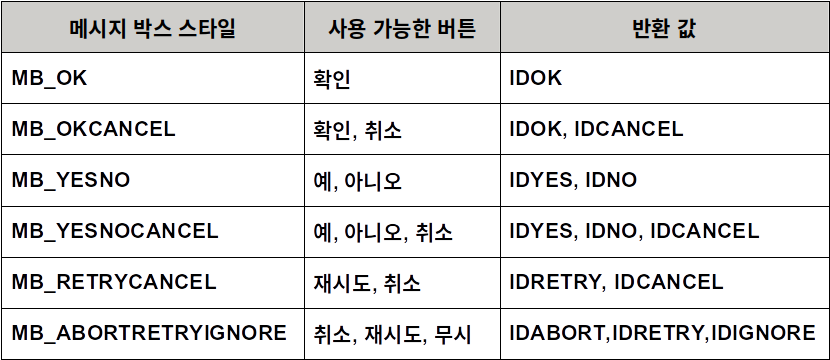
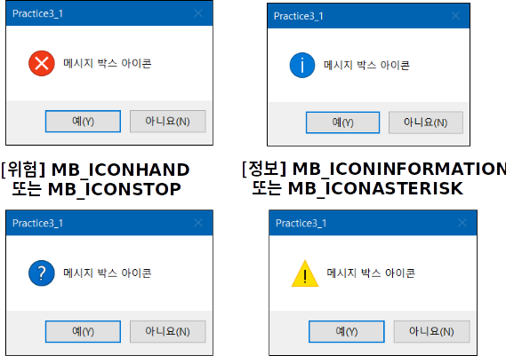
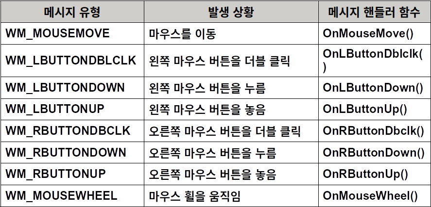
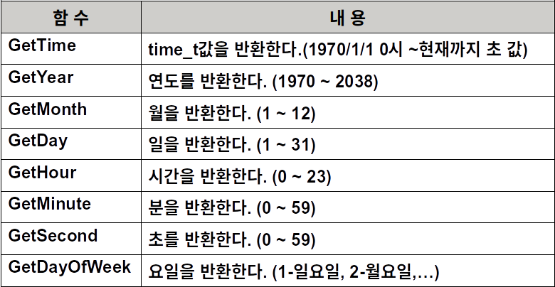
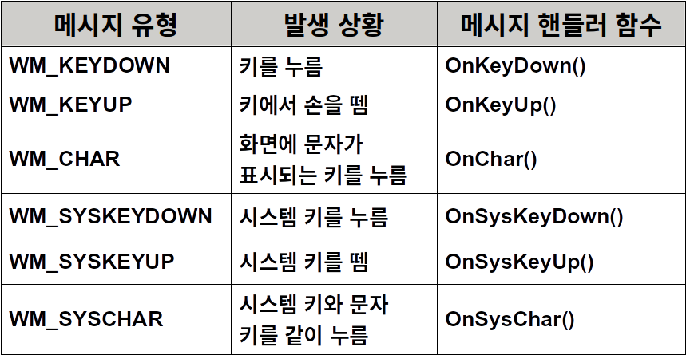

# Visual C++ 2015 MFC Programming

## 메시지 처리

### 메시지 처리의 기본 개념

#### 메시지

- 발생된 이벤트의 종류와 정보를 전달하는 일종의 상수 값


#### 윈도우 프로그래밍

- 가장 중요한 것은 메시지를 처리하는 것


#### 메시지의 종류

- 윈도우 메시지
  - WM_로 시작하는 메시지 (WM_COMMAND는 제외)
  - 매개 변수가 있어 메시지를 어떻게 처리할 것인지를 결정
  - 윈도우 관리 메시지 : 윈도우의 상태가 바뀔 때 발생
  - 초기화 메시지 : 응용 프로그램이 메뉴나 대화상자를 구성할 때 발생
  - 입력 메시지 : 마우스, 키보드로 입력할 때 발생
- 컨트롤 통지 메시지
  - Button, Combo Box와 같은 제어 객체나 자식 윈도우에서 부모 윈도우로 보내는 메시지
- 명령 메시지
  - 메뉴, 툴바, 엑셀레이터 키와 같은 사용자 인터페이스 객체로부터 발생되는 WM_COMMAND 메시지
  - 명령메시지는 윈도우뿐만 아니라 도큐먼트, 도큐먼트 템플릿, 뷰, 다른 애플리케이션 객체에 의해서도 발생될 수 있다.


#### Win32  SDK 프로그램

- 들어온 메시지를 switch문을 사용하여 처리


#### MFC 프로그램

- 메시지 처리를 위해 메시지 맵을 사용


#### 메시지 맵(Message Map)

- 메시지 번호와 메시지가 발생하였을 때 호출되는 함수의 포인터 등의 정보를 갖고 있는 테이블
- 프로그램에 전달된 메시지와 메시지 핸들러 함수를 연결하는데 사용
- 파생 클래스의 메시지 핸들러  함수가 우선


#### 메시지 처리 단계

1. 윈도우 클래스의 멤버 함수로 메시지 핸들러 함수를 선언한다
2. 메시지 맵에 메시지와 메시지 핸들러 함수를 묶는 메시지의 매크로를 추가한다.
3. 메시지 핸들러 함수의 기능을 구현한다.


#### 클래스 마법사

- 위의 세 가지 단계에서 마지막 단계의 메시지 핸들러 함수의 본체만 사용자가 구현하도록 나머지는 자동으로 코딩을 해준다.


#### 메시지 핸들러 함수

- 윈도우로부터 애플리케이션에 메시지가 전달될 때 해당 메시지를 처리하는 멤버 함수

- 함수 이름

  - 윈도우 메시지의 WM_을 떼고 대신 On을 붙여 시작한다.

  - 함수 선언시 afx_msg는 메시지 핸들러 함수라는 것을 나타내는 말이다.	

    ```c++
    //{AFX_MSG(Practice3_1View)
    afx_msg void OnKeyDown();
        …
    //}AFX_MSG
    ```

    

#### 윈도우 관리 메시지와 메시지 핸들러 함수


### 메시지 박스

#### AfxMessageBox() 함수

- 사용자에게 간단한 메시지를 출력하는데 사용되는 대화상자

  ```c++
  Int AfxMessageBox(LPCTSTR lpszText, UINT nType = MB_OK, UINT nIDHelp = 0) 
  ```

- lpszText : 출력하고자 하는 문자열

- nType : 대화상자에 설정되는 버튼

- nIDHelp : 현재 상태에서 F1키를 눌러 도움말을 실행하였을 때의 도움말 ID

- 디폴트 메시지 박스 스타일과 아이콘

- 메시지 박스 스타일 : MB_OK

- 아이콘 : MB_ICONEXCLAMATION


#### 메시지 박스 스타일과 반환 값




#### 아이콘 스타일




### 마우스 메시지

#### 마우스 메시지와 메시지 핸들러 함수




#### 마우스 메시지 핸들러 함수의 매개 변수

- nFlags 
  - 버튼이 눌리면서 키보드에서 특정한 키가 눌려졌을 때의 값이나 마우스의 눌림 값
  - MK_CONTROL : Ctrl 키가 눌림
  - MK_LBUTTON : 왼쪽 마우스 버튼이 눌림
  - MK_MBUTTON : 가운데 마우스 버튼이 눌림
  - MK_RBUTTON : 오른쪽 마우스 버튼이 눌림
  - MK_SHIFT        : Shift 키가 눌림
- point
  - 클라이언트 영역 좌표 값으로 CPoint 클래스를 이용하여 제공된다.


#### 메시지 핸들러 함수의 매개 변수 사용 예

- nFlags & MK_LBUTTON 의 값이 0 이 아니면 마우스 메시지와 함께 왼쪽 마우스 버튼이 눌려졌다는 의미 이다.

- 실습 2-2에서 nFlags의 사용	

  ```c++
  if((nFlags & MK_LBUTTON ) | (nFlags & MK_RBUTTON))
      m_strOutText = "마우스를 드래그하고 있습니다.";
  else
      m_strOutText = "마우스를 이동하였습니다.";
  ```


### 실습

#### SetTimer() 함수

```c++
UINT SetTimer( UINT nIDEvent, UINT nElapse, TIMERPROC lpTimerFunc);
```

- nIDEvent : 타이머 ID
- nElapse : WM_TIMER 메시지를 발생시킬 시간 간격이다. 사용되는 단위는 1000분의 1초이다. 1초에 한번 메시지를 발생시키기 위해서는 1000으로 설정해주면 된다.
- lpTimerFunc : WM_TIMER 메시지가 발생되었을 때 실행되는 함수이다. NULL로 설정되면 OnTimer()함수가 호출된다 


#### KillTimer() 함수

```c++
KillTimer(int nIDEvent);
```

- 이 함수는 Timer를 해제한다
- KillTimer() 함수의 인수는 SetTimer에서 설정된 Timer 의 ID이다.


#### CTime 클래스

- 시간과 날짜를 표현하고, 저장하기 위한 클래스
- 주요 CTime 클래스의 멤버 함수




### 키보드 메시지

#### 키보드 메시지와 메시지 핸들러 함수




#### 문자가 입력된 사건에 발생되는 메시지

- 먼저 WM_KEYDOWN이 발생되고 WM_CHAR가 발생되고 마지막으로 WM_KEYUP이 발생된다.


#### 키보드 메시지 핸들러 함수의 매개 변수

- nChar : 눌려진 키의 가상키 코드이다.  
- WM_CHAR 의 경우에는 눌려진 키의 문자 코드
- nRepCount : 키를 계속 누르고 있을 경우 반복된 키의 입력 횟수이다.
- nFlags : 스캔코드, 이전 키 상태, 키가 눌러질 때의 Alt 키의 상태에 관한 정보가 전달된다.