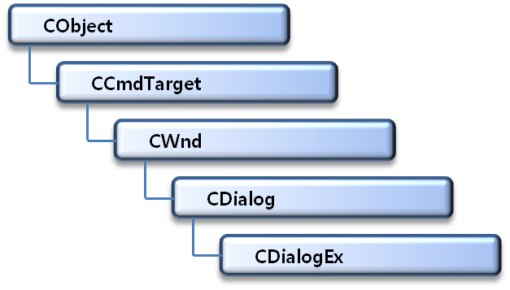
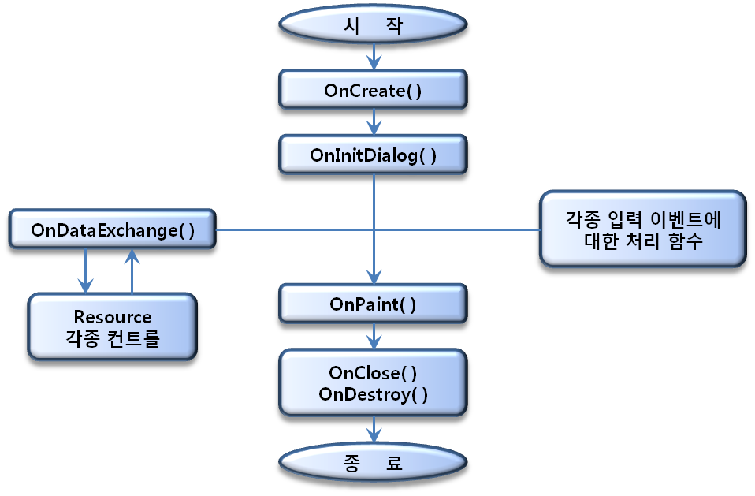

# Visual C++ 2015 MFC Programming

## 대화 상자

#### 대화상자

- 사용자와 윈도우간의 인터페이스


#### CDialogEx 클래스

- 대화상자는 CDialogEx 클래스로 정의
- 모든 윈도우 메시지 처리 가능
- 배경색과 배경그림 바꾸는 기능 추가
  - SetBackgroundColor()
  - SetBackgroundImage()


#### 대화상자의 계층도




#### 다이얼로그 기반의 프로그램

- 애플리케이션 클래스와 다이얼로그 클래스로 구성


#### 대화상자 프로그램의 동작




### MFC 기본 컨트롤

#### Static Text

- 화면에 문자열을 배치할 때 사용하는 컨트롤


#### Edit Control

- 문자열을 입력하고 편집할 수 있는 컨트롤


#### Group Box

- 서로 연관된 컨트롤을 시각적으로 그룹 지어 다른 컨트롤과 구분하는 용도로 사용
- 그룹 박스로 묶는다고 기능은 변경되지 않음


#### Button Control

- 마우스로 클릭하여 어떤 동작을 수행하는 용도로 사용하는 컨트롤


#### Check Box

- 버튼 컨트롤의 일종으로 독립적인 옵션을 선택할 때 사용하는 컨트롤
- 마우스로 클릭하면 체크표시가 on/off 됨
- 여러 옵션 중 임의의 개수를 선택할 때 사용


#### Radio Button

- 버튼 컨트롤의 일종으로 상호 배타적인 옵션을 선택할 때 사용하는 컨트롤
- 마우스로 클릭하면 라디오 표시가 on/off 됨
- 여러 옵션 중 하나 만 선택할 때 사용


#### List Box

- 여러 개의 선택 항목을 나열하고 선택할 수 있도록 해주는 컨트롤
- 하나 또는 여러 개를 선택할 수 있음


#### Combo Box

- 리스트 박스의 단점을 해결한 것으로 에디트 컨트롤과  리스트 박스를 합쳐 놓은 모양
- 기존의 항목을 선택할 때는 아래의 리스트 박스에서 선택
- 직접 입력할 경우는 에디트 컨트롤에서 입력할 수 있음
- 리스트 박스를 평소에 닫아두기 때문에 화면면적을  넓게 차지하지 않음.


#### 컨트롤을 멤버변수와 연결하는 방법

##### DDX를 이용하는 방법

- Value : 

  - 컨트롤에 설정되어 있는 값만 연결
  - DDX_Text 계열 함수를 이용하여 자원에 연결

- Control : 

  - 해당 컨트롤을 제어할 수 있는 컨트롤 클래스와 연결
  - DDX_Control 계열 함수를 이용하여 자원에 연결

  

##### 컨트롤의 핸들로 클래스와 연결하는 방법

- 컨트롤의 핸들을 얻기 위해 컨트롤의 포인터를 받을 포인터 변수를 선언

- GetDlgItem() 함수를 이용하여 컨트롤의 포인터를 선언된 포인터 변수에 치환한다.

- 클래스의 멤버를 이용하여 컨트롤을 다룬다.

  ```c++
  CListBox *pList;
  pList = (CListBox *)GeDlgItem(IDC_LIST1);	
  pList->AddString(“데이터”);
  ```


#### DoDataExchange() 함수

- 대화상자의 여러 자원을 연결하는 기능을 하는 함수
- 이 함수 안에는 DDX_Text 함수나 DDX_Control 함수를 이용하여 자원과 연결
- DDX_Control 형태로 연결되었을 경우는 변수가 클래스로부터 상속 받았으므로 클래스의 멤버 함수를 마음대로 사용할 수 있다.


#### UpdateData() 함수

- DDX_Value 형태로 연결되었을 경우는 UpdateData() 함수를 사용하여 자원을 update하여야 한다.
- 컨트롤에 있는 데이터를 변수에 가져오고자 한다면 UpdateData(TRUE)를 사용한다.
- 변수에 특정 값을 주고 그 값을 컨트롤에 보내고 싶다면 UpdateData(FALSE)를 사용한다.


#### CListBox 클래스의 주요 멤버 함수

- GetCount( )함수

  - ListBox의 아이템 수를 알기 위해 사용하는 함수

- AddString( ) 함수

  - ListBox의 맨 뒤에 문자열을 추가할 때 사용하는 함수

- GetText( )함수

  ```c++
  void GetText(int nINdex, CString& rString);
  ```

  - ListBox로부터 문자열을 얻어올 때 사용되는 함수

- DeleteString( ) 함수

  - ListBox의 아이템을 삭제할 때 사용하는 함수


#### CComboBox 클래스의 주요 멤버 함수

- ResetContent( )함수

  - ComboBox의 모든 아이템을 제거할 때 사용하는 함수

- AddString( ) 함수

  - ComboBox의 맨 뒤에 문자열을 추가할 때 사용하는 함수

- GetCurSel( )함수

  ```c++
  int GetCurSel() const;
  ```

  - ComboBox에서 선택된 항목의 색인을 반환하는 함수


### 대화 상자

#### 모달(Modal) 대화상자

- 모달 대화상자가 출력되면 부모 윈도우에서 작업을 할 수 없다.
- 모달 대화상자를 닫아야 부모 윈도우에 포커스를 둘 수 있다.
- DoModal()함수를 이용하여 출력한다


#### 모덜리스(Modeless) 대화상자

- 모달 대화상자와는 달리 모덜리스 대화상자는 닫지 않고도 애플리케이션 내의 다른 윈도우에서 작업할 수 있고 다시 대

- 화상자로 돌아와 작업할 수 있는 대화상자

- 모덜리스 대화상자의 생성 방법

  1. 대화상자에 대한 변수 선언

  2. Create()함수를 이용하여 대화상자 생성

  3. 생성한 대화상자를 화면에 표시

     ```c++
     CExDialogDlg m_Dlg;
     m_Dlg.Create(IDD_EXDIALOG, this);
     m_Dlg.ShowWindow(SW_SHOW)
     ```

     

### 공용 대화상자

#### File 대화상자	

- CFileDialog 클래스로 정의

- 생성자 함수에서 다음과 같이 호출

  ```c++
  CFileDialog pDlg(TRUE); 
  pDlg.DoModal();
  ```

  TRUE : Open 대화상자, FALSE : SaveAS 대화상자.


#### CFileDialog의 생성자 함수

```c++
CFileDialog(
	BOOL 		bOpenFileDialog, 
	LPCTSTR  	lpszDefExt = NULL,	
	LPCTSTR 	lpszFileName = NULL,
	DWORD   	dwFlags = OFN_HIDEREADONLY |
			 	   OFN_OVERWRITEPROMPT,
	LPCTSTR  	lpszFilter = NULL, 
	CWnd* 		pParentWnd = NULL 
);
```


#### Open 대화상자 출력 예

```c++
char Filter[ ] = _T("Text File(*.txt) | *.txt| 모든 파일(*.*)|*.*|“);
CFileDialog pDlg(TRUE, _T("text file(*.txt)", "*.txt“),
   OFN_HIDEREADONLY | OFN_FILEMUSTEXIST, Filter, NULL);
	
if(pDlg.DoModal() == IDOK)
{
	  data = pDlg.GetPathName();
	    …
	    …
	    … 
}
```


#### Save 대화상자 출력 예

```c++
char Filter[ ] = _("Text File(*.txt) | *.txt| 모든 파일(*.*) |*.*|“);
CFileDialog pDlg(FALSE, _T("text file(*.txt)", "*.txt“),
   OFN_HIDEREADONLY | OFN_FILEMUSTEXIST, Filter, NULL);
	
if(pDlg.DoModal() == IDOK)
{
	   data = pDlg.GetPathName();
	     …  
	     …
	     …
}
```


#### Font 대화상자

- 주로 텍스트 기반 애플리케이션에서 사용
- Font 대화상자는 텍스트의 글꼴, 크기, 문자 속성 등을 지정할 수 있는 대화상자
- 해당 클래스는 CFontDialog


#### Font 대화상자 출력하는 방법

```c++
CFontDialog fontDlg;
fontDlg.DoModal();
```


#### Font를 받는 방법

- 폰트 구조체로 받음

  ```c++
  LOGFONT  logfont;
  fontDlg.GetCurrentFont(&logfont);
  ```

- 실제 글꼴 생성

  ```c++
  CFont font;
  font.CreateFontIndirect(&logfont);
  ```

- 현재 DC의 글꼴을 선택함으로써 글꼴을 사용할 수 있다


#### Color 대화상자

- 사용자에게 색상을 선택하게 하는 대화상자
- 해당 클래스는 CColorDialog


#### Color 대화상자 사용법

```c++
CColorDialog colorDlg;
If (colorDlg.DoModal() == IDOK)
{
      COLORREF m_color = colorDlg.GetColor();
}
```


### 실습

#### CWnd 클래스 멤버 함수

- GetWindowRect( ) 함수

  ```c++
  void GetWindowRect(LPRECT lpRect) const;
  ```

  - 윈도우의 크기를 알기 위해 사용하는 함수

- MoveWindow( ) 함수

  ```c++
  void MoveWindow(int x, int y, int nWidth, int nHeight, BOOL bRepaint = TRUE)
  ```

  - 윈도우의 위치와 크기를 변경하는 함수