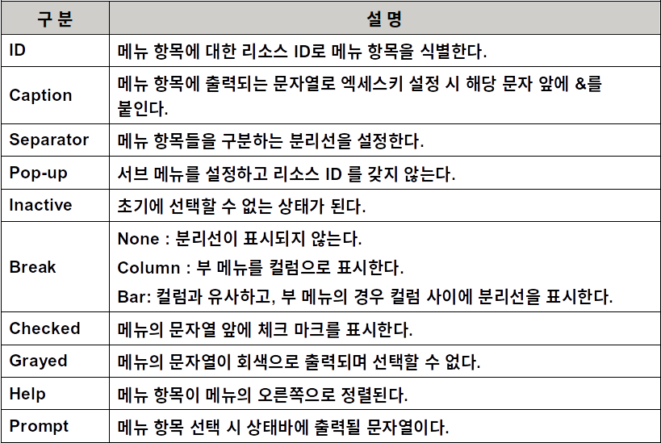

# Visual C++ 2015 MFC Programming

## 사용자 인터페이스

### 메뉴(Menu)

#### 메뉴

- 메뉴는 해당 애플리케이션이 갖고 있는 기능을 사용자에게 알려주고, 사용자의 선택에 따라 기능을 수행할 수 있게 하는 사용자 인터페이스이다.


#### 메뉴의 종류

- 풀 다운 메뉴
- 캐스캐이딩 메뉴
- 팝업 메뉴 또는 문맥 메뉴


#### 풀다운 메뉴(pull-down menu)

- 사용자가 메뉴 카테고리 하나를 선택하면 선택된 카테고리 아래로 메뉴가 뚝 떨어지면서 애플리케이션의 기능을 작동시킬 수 있는 메뉴항목이 나타난다.


#### 캐스캐이딩 메뉴(cascading menu)

- 풀다운 메뉴에서 변형된 형태로, 메뉴 항목의 오른쪽에 또 하나의 서브 메뉴가 나타나는 메뉴이다.


#### 팝업 메뉴(pop-up) 또는 문맥 메뉴

- 애플리케이션 영역의 중간에서 자유롭게 튀어나오는 메뉴
- 대표적인 팝업 메뉴는 오른 쪽 마우스 버튼을 클릭하면 나오는 단축 메뉴이다.  


#### 메뉴 리소스

- [Resource View]의 Menu에서 IDR_MAINFRAME을 더블 클릭하면 기본 메뉴가 나타난다.


#### 기본 메뉴

- [파일], [편집], [보기], [도움말]


#### 메뉴 항목의 속성

- 기본 메뉴 상단에 있는 메뉴의 항목을 더블 클릭하면 메뉴 항목의 속성을 설정하는 [Menu Item Properties] 대화상자가 나타나면 원하는 속성을 설정할 수 있다.


#### 메뉴 속성 항목




### 실습

#### 명령 메시지 함수

- 프로그램 실행 중에 사용자가 메뉴 항목을 선택하면 WM_COMMAND 메시지 발생하고 메뉴의 ID가 추가적인 정보로 전달
- WM_COMMAND 메시지는 메뉴의 ID에 따라 여러 가지 동작을 하도록 사용되기 때문에 OnCommand() 메시지 핸들러 함수에서 모든 메시지를 처리하지 않고, 특정 명령 메시지와 이를 처리하는 명령 메시지 핸들러 함수를 메시지 맵에 등록한다.
- 어떤 명령 메시지를 처리하는 핸들러 함수를 어느 클래스에 만들 것인가는 명령 메시지 성격에 따라 프로그래머가 결정한다.


#### 사용자 인터페이스 갱신 메시지 함수

- UPDATE_COMMAND_UI 메시지는 메뉴 항목이 표시되기 전에 보내지는 메시지로 메뉴 항목을 변경하고자 할 때 사용한다.
- 이 메시지를 처리하는 함수를 사용자 인터페이스 갱신 메시지 핸들러 함수라 하고 함수 이름이 OnUpdate로 시작한다.
- 예를 들면 메뉴 항목을 선택 못하게 그레이 메뉴로 만들거나 메뉴 항목 앞에 체크 표시를 할 때 이 메시지 함수로 처리한다.


### 툴바(Toolbar)

#### 툴바

- 한 줄 또는 여러 줄의 명령버튼을 포함하는 윈도우
- 툴바는 메뉴 명령의 시각적인 표현이기 때문에 메뉴의 동작에 대한 구현과 매우 흡사하다.


#### 툴바 항목의 속성

- 기본 툴바 상단에 있는 툴바의 항목을 더블 클릭하면 툴바 항목의 속성을 설정하는 [Toolbar Button Properties] 대화상자가 나타나면 원하는 속성을 설정할 수 있다.


#### 간단한 툴바 만들기

- 이번 실습은 툴바를 만드는 프로그램을 작성하는 것이다. 이 실습을 통해 툴바를 어떻게 만들고 작동시키는지 배우게 될 것이다.


### 상태 표시줄(Status Bar)

#### 상태 표시줄

- 메인 프레임 하단부에 위치하여 특정 항목을 선택하면 해당 항목의 도움말이 출력되는 형태의 윈도우
- 상태 표시줄은 팬이라 불리는 표시 영역들로 나뉜다.
  - 고정되거나 변화할 수 있는 크기를 갖는다.
  - 제일 왼쪽의 팬은 가변 크기 팬이다


#### 상태 표시줄을 만드는 단계

1. CStatusBar의 객체를 만든다.
2. CStatusBar::Create 함수를 사용하여 상태표시줄 윈도우를 만든다.
3. 팬을 만들고, 그 크기를 지정한다.


#### AppWizard에서 생성된 상태 표시줄 코드

1. 상태 표시줄의 멤버 변수 선언(MainFrm.h)

   ```c++
   protected:  // control bar embedded members
   	CStatusBar  m_wndStatusBar;
   ```

2. 상태 표시줄을 분할하는 지시자 설정 (MainFrm.cpp) 

   ```c++
   static UINT indicators[ ] =
   {
         ID_SEPARATOR,      	 // status line indicator
         ID_INDICATOR_CAPS,
         ID_INDICATOR_NUM,
         ID_INDICATOR_SCRL,
   };
   ```

3. 윈도우 생성시 상태 표시줄을 생성하는 부분     (MainFrm.cpp에 구현)

   ```c++
   int CMainFrame::OnCreate(LPCREATESTRUCT lpCreateStruct)
   {
       if (CFrameWnd::OnCreate(lpCreateStruct) == -1)
           return -1;
       if (!m_wndStatusBar.Create(this) || !m_wndStatusBar.SetIndicators(indicators, sizeof(indicators)/sizeof(UINT)))
       {
           TRACE0("Failed to create status bar");
           return -1;      // fail to create
       }
       return 0;
   }
   ```

   

#### 도킹 팬(Docking Pane) 윈도우

#### 도킹 팬 윈도우

- Visual Studio 2008 SP1 Feature Pack부터 적용된 인터페이스 기술.
- 도킹 팬 윈도우의 일반적인 특징은 툴 바 또는 다이얼로그 바와 같이 프레임 윈도우의 어떤 부분이라도 자유롭게 도킹할 수 있다.
- 탭(Tab) 윈도우를 이용한 중첩이 가능하다는 점과 분할 윈도우를 이용한 영역배치를 할 수 있다.

- 캡션(Caption), 자동 숨기기(Auto hide), 컨텍스트 메뉴(Context menu) 등 유용한 기능을 가지고 있다.
- 대화상자에 포함되는 모든 컨트롤들을 처리할 수 있다. 컨트롤이 보내는 메시지도 처리 가능하다.
- 도킹 팬 윈도우를 가장 잘 활용하고 있는 예시가 바로 우리가 사용하고 있는 Visual Studio이다.