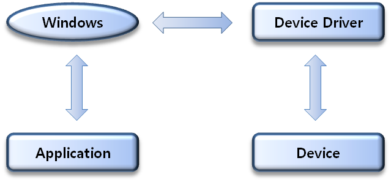
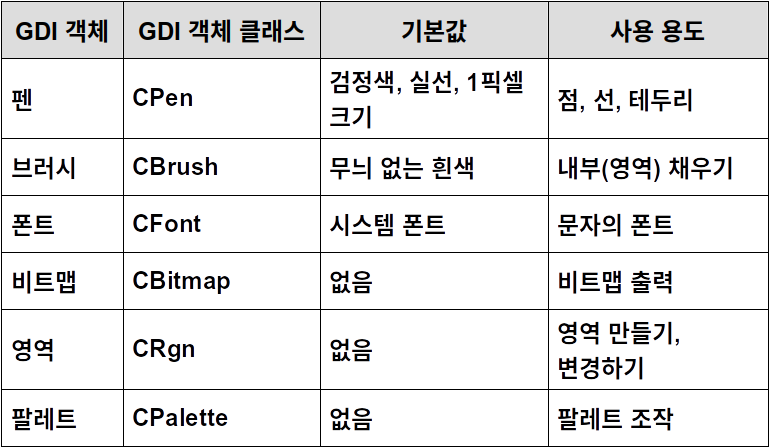
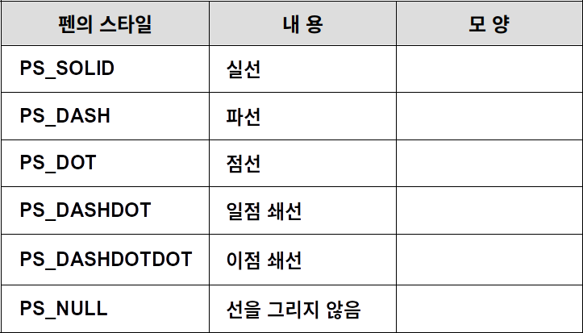
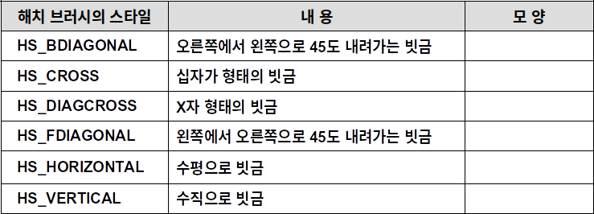
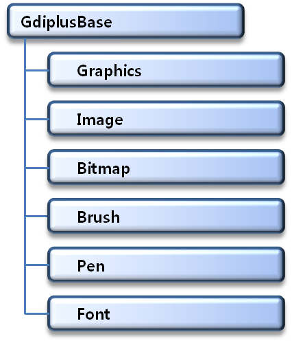
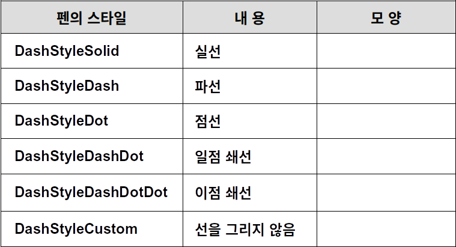
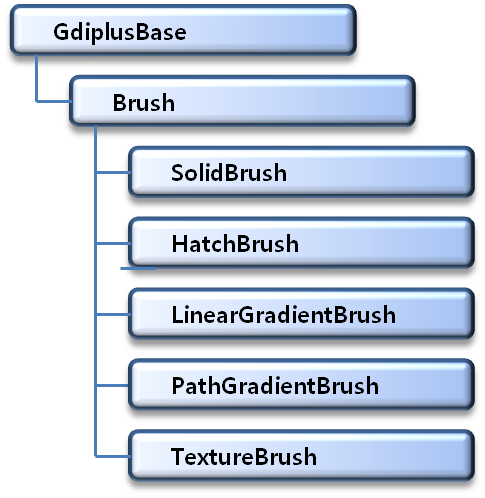

# Visual C++ 2015 MFC Programming

## 그래픽 객체의 사용

### GDI의 개념

#### Graphic Device Interface

- 윈도우가 하드웨어를 제어할 수 있도록 응용 프로그램에 제공하는 모든 기능
- 응용 프로그램과 디바이스 드라이버의 중간 역할
- 응용 프로그램에 대한  장치 독립적인 그래픽 동작 수행




### Device Context(DC)의 개념

#### 일종의 핸들

- 애플리케이션과 출력 장치를 연결하는 역할
- 애플리케이션이 출력에 대한 허가를 얻고, 또한 그려지는 영역을 결정하는 역할


#### GDI에 의해 내부적으로 유지되는 데이터 구조

- 여러 가지 그래픽 속성에 대한 값을 가짐
- Ex) 텍스트 속성/색상, 매핑 모드, 글꼴


#### DC를 사용하는 이유

- 독립적인 하드웨어 출력을 할 수 있어 출력장치에 상관없이 동일한 방법으로 출력을 설정
- DC를 얻고 나면, 반드시 작업 완료 시 해제한다


### DC를 얻는 방법

#### 4가지 DC를 얻는 방법

1. OnDraw()함수, OnPaint()함수를 이용

   - OnDraw() 함수의 인자 - CDC 오브젝트

     ```c++
     Void CPractice6_1View:: OnDraw(CDC * pDC)
     {
     	 …
     }
     ```

   - OnPaint() 함수 내의 CPaintDC 오브젝트

     ```c++
     Void CPractice6_1View::OnPaint()
     {
         CPaintDC dc(this)
     	 …
     }
     ```

   - 윈도우나 클라이언트 영역이 다시 그려져야 할 경우 수행

   - DC의 해제는 MFC 내부 코드에 존재한다.

2. GetDC() 함수를 이용

   - 이 함수의 포인터 반환 값을 받아서 사용

   - ReleaseDC()함수를 호출하여 반드시 해제

     ```c++
     CDC *pDC = GetDC();
     …
     ReleaseDC(pDC);
     ```

   - 이 방법으로 DC를 얻는 것은 일시적인 것으로 윈도우의 크기가 변하면 출력한 내용이 사라진다.

3. CClientDC 클래스를 이용

   - CClientDC 는 CDC 클래스의 파생 클래스

   - Device Context의 생성/해제 자동적 수행

     - 생성자 함수에서 GetDC()함수를 호출
     - 소멸자 함수에서 ReleaseDC()함수를 호출

   - 윈도우에 대한 핸들 값이 필요

   - 일시적으로 윈도우의 클라이언트 영역에서 그래픽 개체를 사용할 경우에 이용

     ```c++
     CClientDC dc(this)
     ```

4. CWindowDC 클래스를 이용

   - 윈도우(프레임) 영역에 그래픽 요소를 출력하고자 할 때 사용한다.

   - GetWindowDC()함수를 이용하여 CWindowDC 클래스의 인스턴스를 포인터 형태로 넘겨 받아 이용

   - 작업 수행 후, ReleaseDC()함수로 해제

     ```c++
     CWindowDC *pDC = GetWindowDC();
     …
     ReleaseDC();
     ```

     


### GDI 객체

#### GDI 기본 구성 요소

- 선과 곡선(Lines and Curves)
  - 직선, 사각형, 타원, 호, 베지어 곡선
- 채워진 영역(Filled Areas)
  - 브러시 개체를 이용 – 색상, 패턴, 비트맵 이미지
- 비트맵(Bitmaps)
  - 디스플레이 장치의 픽셀과 일치하는 직사각형 배열
  - 래스터 그래픽의 기본적인 도구
- 텍스트(Text)


#### 화면에 그래픽 출력하기위한 요소




#### 객체를 사용하는 방법

1. GDI 객체를 생성 
   - 객체 클래스의 Create계열 함수 이용
2. 객체를 DC에 등록 
   - SelectObject()함수를 이용
   - 기존 설정된 객체는 포인터로 저장	
3.  DC를 사용하여 그래픽 출력
4. 이전 객체로 환원
5. 객체를 삭제
   - DeleteObject()함수 이용


#### 펜(Pen)

- 선이나 영역의 경계선을 그릴 때 사용
- 선의 두께, 선이 색상, 선의 스타일을 설정


#### 펜을 사용하는 방법

```c++
CPen pen *oldpen
pen.CreatePen(PS_SOLID, 1,RGB(0,0,0));
oldpen = pDC->SelectObject(&pen);
pDC->Ellipse(0,0,10,10);
pDC->SelectObject(oldpen);
pen.DeleteObject();
```


#### CreatePen() 함수

- CreatePen() 함수는 Pen을 생성하는 함수로 원형은 다음과 같다.

```c++
BOOL CreatePen(int nPenStyle, int nWidth, COLORREF crColor);
```

- nPenStyle : 펜의 스타일
- nWidth : 펜의 굵기
- crColor : 펜의 색상


#### 펜의 스타일




#### 브러시(Brush)

- 영역의 내부를 채울 때 사용
- 채울 색, 패턴 등이 사용


#### 브러시를 사용하는 방법

```c++
CBrush brush *oldbrush
brush.CreateSolidBrush(RGB(0,0,0));
bush.CreateHatchBrush(HS_CROSS,RGB(0,0,0));
oldbrush = pDC->SelectObject(&brush);
pDC->Ellipse(0,0,10,10);
pDC->SelectObject(oldbrush);
brush.DeleteObject();
```


#### CreateSolidBrush() 함수

- 단일 색으로 칠하는 브러시를 생성하는 함수


#### CreateHatchBrush() 함수

- 일정한 패턴을 가진 해치 브러시를 생성하는 함수.
- 해치 브러쉬의 스타일




#### 선 그리기

```c++
MoveTo(int x, int y) 함수
LineTo(int x, int y)함수
```


#### 사각형 그리기

```c++
Rectangle(int x1, int y1, int x2, int y2)
```


#### 원 그리기

```c++
Ellipse(int x1, int y1, int x2, int y2)
```


#### 다각형 그리기

```c++
Polyline(LPPOINT lpPoints, int nCount)
Polygon(LPPOINT lpPoints, int nCount)
```


#### 베지어 곡선 그리기

```c++
PolyBezier(const POINT* lpPoints, int nCount)
```


### 래스터 오퍼레이션

- 새로 그려야 할 그림과 기존의 화면에 그려져 있는 그림을 합성하는 것
- 펜과 브러시에 적용되며 SetROP2()함수로 설정한다.
  - R2_COPYPEN : 배경그림 무시하고 새로 그려지는 그림을 출력
  - R2_XORPEN : 한번 그리면 그림이 그려지고 다시 한번 그리면 원래의 바탕색이 복원 


#### 비트맵

- CBitmap클래스를 이용하는 객체로 비트맵을 생성하거나 읽어서 비트맵을 출력할 때 사용
- 비트맵의 래스터 오퍼레이션
  - SRCCOPY : 배경그림 무시하고 비트맵 출력
  - SRCAND : 배경그림과 AND 연산
  - SRCPAINT : 배경그림과 OR 연산


#### 비트맵을 사용하는 방법

1. 화면 DC와 메모리 DC를 생성

   ```c++
   CClinetDC dc(this);
   CDC memdc;
   ```

2. 화면 DC와 호환성을 갖는 DC를 만든다.

   ```c++
   memdc.CreateCompatibleDC(&dc);
   ```

3. 비트맵을 읽어온다

   ```c++
   CBitmap bitmap, *oldbitmap;
   bitmap.LoadBitmap(IDB_BITMAP1);
   ```

4. 메모리 DC에 비트맵을 설정한다.

   ```c++
   oldbitmap = memdc.SelectObject(&bitmap);
   ```

5. 비트맵 블록을 전송한다.

   ```c++
   dc.BitBlt(0, 0, 450, 85, &memdc, 0, 0, SRCCOPY);
   ```

6. DC를 복원한다.

   ```c++
   memdc.SelectObject(oldbitmap);
   ```


#### 폰트(font)

- CFont 클래스를 이용하는 객체로 문자를 출력할 때 사용하며 글자의 모양, 크기가 설정
- 폰트의 종류
  - 논리적인 폰트 : 이상적인 폰트에 대한 표현으로 실제로 존재하는 것이 아니라 유사한 폰트를 얻기 위해 사용
  - 물리적인 폰트 : 실제로 시스템에 설치되어 있는 폰트를 의미하며 실제로 화면에 나타난다.


#### 폰트를 사용하는 방법

- 폰트를 출력하기 위해서는 원하는 폰트에 대해 논리적인 폰트를 LOGFONT타입으로 기술하여 생성하고 DC에 폰트를 선택하여 넣는다.
- 윈도우 GDI 의 폰트 맵퍼가 시스템에 설치되어 있는 폰트들 중에 가장 가까운 물리적인 폰트를 찾아 출력한다.


#### 러버밴드 기법

- 그리기 작업을 하다 보면 마우스의 움직임에 따라 가상의 선이 늘었다 줄었다 하는 것을 볼 수 있는데 이러한 것을 러버밴드(Rubber Band)라고 부른다.

- 러버밴드로 그림을 그리려면 R2_NOTXORPEN 래스터 오퍼레이션을 사용하여 그림을 그린다. 
- 구현 방법
  - 이전에 그려진 그림을 지움 
  - 새로운 그림을 그림 
  - 마우스가 움직였을 때 이전에 그려진 그림이 지워질 수 있도록 현재 점 저장 


### GDI+의 개념

#### GDI+

- GDI모듈의 업그레이드 버전
- 복잡하고 섬세한 그래픽을 출력할 수 있는 모듈


#### GDI와 GDI+의 차이점

- GDI+는 Graphics 객체를 먼저 생성해야 한다.
  - 그리기 함수들은 Graphics 클래스의 멤버함수
- 출력함수들은 그리기에 필요한 값을 인수로 전달받는다.
- 똑같은 도형을 그리는 함수도 인수의 타입에 따라 여러 가지로 나뉜다.
- GDI+ 오브젝트들은 C++객체이므로 메모리 해제하는 코드를 따로 작성할 필요가 없다.
  - 소멸자 함수에서 메모리를 해제해준다
- GDI+에서 사용하는 문자열은 유니코드 시스템을 사용해야 한다.
- GDI+에서는 다양한 그래픽 파일 포맷을 지원한다.


#### GDI+ 클래스 계층




#### Graphics 클래스

- GDI+의 가장 중요하고 기본이 되는 클래스
- 출력을 하려면 이 클래스의 객체를 먼저 생성해야 한다.
- 다양한 생성자 함수
  - Graphics(HDC hdc)
  - Graphics(HDC hdc, HANDLE hdevice)
  - Graphics(HWND hwnd, BOOL im)
  - Graphics(Image* image)


#### Pen 클래스

- 선을 그릴 때 사용하는 그래픽 오브젝트
- 생성자 함수
  - Pen(const Color &color, REAL width)
  - Pen(const Brush *brush, REAL width)
- SetDashStyle( )함수
  - 선의 모양을 변경하는 함수
  - 함수 원형
    - SetDashStyle(DashStyle dashStyle)


#### SetDashStyle 펜의 스타일




#### Brush 클래스

- 채색하는 무늬를 만드는 방법에 따라 여러 종류의 클래스 계층을 구성



- LinearGradientBrush 클래스
- 지정한 두 색상이 점점 변하는 모양으로 채색하는 브러시
- 6가지 생성자 함수가 있음
  - LinearGradientBrush(const Point &point1, const Point &point2, const Color &color1, const Color &color2)