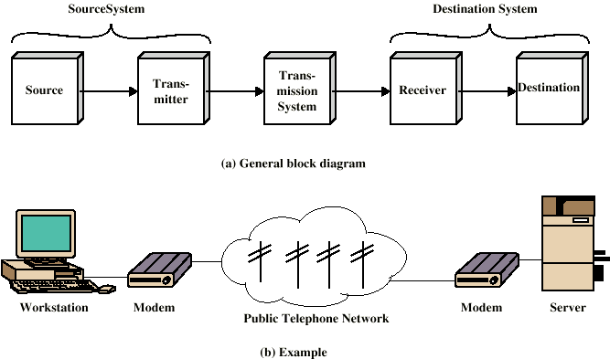
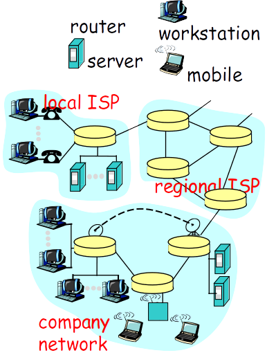
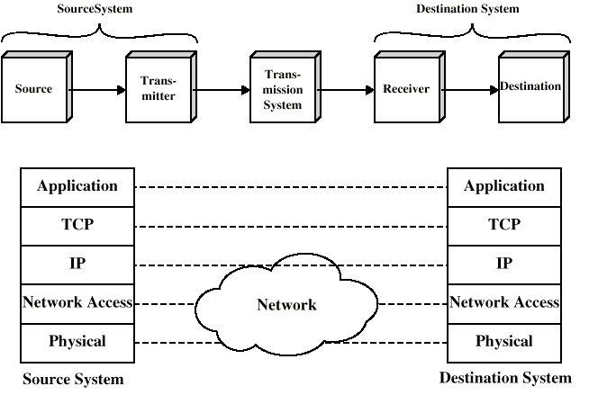
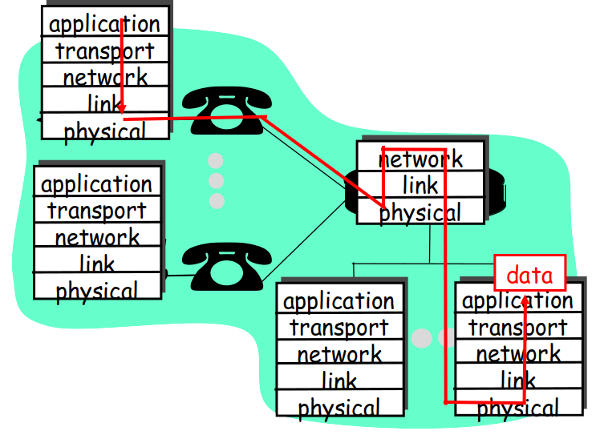
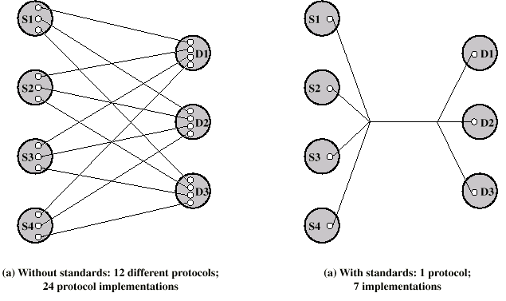
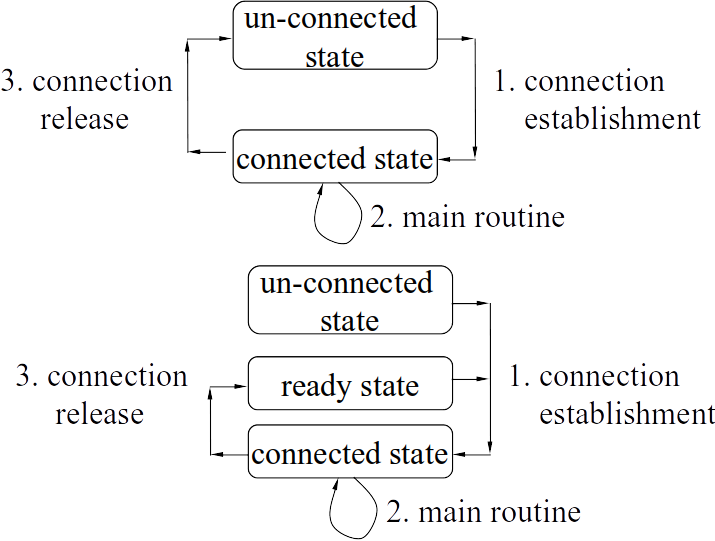

# 데이터 통신과 네트워크

## 컴퓨터 네트워크 소개

### 데이터 통신 네트워크 모델

#### 모델

- 복잡한 시스템을 나타내는 주요 요소로 구성된 단순화 표현

#### 의사소통 모델

- source(송신자) : 전송할 데이터 생성
- transmitter(송신기) : 데이터를 전송 신호로 변환
- transmission System(전송 시스템) : 데이터 전송
  - **네트워크**라고 불리어짐
  - LAN, MAN, WAN, 인터넷, ADSL를 포함할 수 있음
- receiver(수신기) : 받은 신호를 데이터로 변환
- destination(수신자) : 들어오는 데이터를 가져옴

#### 네트워크 구성 요소

- link
  - 케이블, 광섬유와 같은 전송 매체
- node
  - host: PC나 서버
  - network devices: 라우터, 스위치 

### ITU 통신 네트워크

#### ISDN (Integrated Services Digital Network) 

- 공공 통신 시스템을 대체하도록 설계

- 다양한 서비스

- 완전히 디지털 도메인

- 전화와 데이터 전송을 함께 보낼 수 있는 최초의 네트워크

  

#### 프레임 릴레이

- 오류 제어를 위한 대부분의 오버 헤드는 ISDN 또는 ATM에서 제거됨
- 패킷 교환 시스템은 오류를 복구하기 위해 오버 헤드가 큼
- 최신 시스템은 더 안정적이므로 간단한 오류 복구로 충분함
- 최종 시스템 (서버 및 PC) 만 오류를 확인할 수 있음
- 1990 년 말 ~ 2000 년 초에 사용 된 데이터 전송에만 해당

#### ATM (Asynchronous Transfer Mode)

- 프레임 릴레이의 진화
- 오류 제어를위한 오버 헤드가 거의 없음 (프레임 릴레이와 동일)
- 고정 패킷 (셀이라고 함) 길이
- 빠름 : 기본 속도 = 155Mbps
- 데이터, 전화 및 실시간 멀티미디어 서비스

#### xDSL

- 광대역 네트워크 제품군으로 시작 (= ATM)
- 전화선과 함께 사용되는 고속 액세스 네트워크 용.

### IETF 통신 네트워크

#### IEEE802에 의한 근거리 통신망

- 더 작은 범위
  - 건물 또는 소규모 캠퍼스
- 일반적으로 동일한 조직에서 소유
- 훨씬 높은 데이터 속도 (10Mbps ~ 10Gbps)
- (이전) 브로드 캐스트 시스템이지만 현재 비 브로드 캐스트로 변경됨
- 90 % 이상이 이더넷, 무선 LAN, Wibro, 메트로 (이더넷)

#### IETF에 의한 인터넷

- TCP/IP, SIP, …

### IETF에 의한 TCP / IP 모델

#### 5층 모델의 핵심 동작

| 레이어                        | 역할                                                         |
| ----------------------------- | ------------------------------------------------------------ |
| application(응용)             | 사용자 편의를 위한 메시지 생성                               |
| transport(전송)               | 수신 및 송신의 메시지가 동일함을 보장 (전송 오류가 발생하면 재전송이 필요합니다) |
| network(네트워크)             | 대상 노드에 도달하는 방법을 제공 (인터넷은 탐색 정보만 제공). 필요한 경우 연동 |
| network access(네트워크 접근) | 프레임을 생성하여 피어 노드로 보냄 + LAN                     |
| physical(물리)                | 피어 노드에 비트를 보냄                                      |

- L2와 L4의 차이
  - 링크 전송 (one-hop 전송)을 담당하는 L2
  - 종단 간 (수신자 - 송신자) 전송을 담당하는 L4
- 응용 계층
  - 사용자 응용 프로그램 지원
  - 예 : http, SMTP
- 전송 계층 (TCP)
  - 안정적인 데이터 전달
- 인터넷 계층 (IP)
  - 시스템이 다른 네트워크에 연결되어 있을 수 있음
  - 여러 네트워크에서 라우팅 기능
  - 최종 시스템 및 라우터에서 구현
    - 그러나 주요 행동은 라우터에서 발생
- 네트워크 액세스 계층
  - 종단 시스템과 네트워크 간 데이터 교환
  - 목적지 주소 제공 : IP 주소
  - 우선 순위와 같은 서비스 호출
- 물리 계층
  - 데이터 전송 장치 (예 : 컴퓨터)와 전송 매체 또는 네트워크 간의 물리적 인터페이스
  - 전송 매체의 특성
  - 신호 레벨
  - 데이터 속도

### 데이터 전송

### ITU에 의한 OSI 7 계층 모델

#### OSI 모델 (오픈 시스템 상호 연결)

- 국제 표준화기구 (ISO)에 의해 개발
- 이론적 시스템 : 현재 사용되지 않음
  - TCP / IP 모델 (OSI 7 계층 모델 아님)이 사실상 표준입니다.

#### OSI 7 레이어

- Application (application)
- Presentation (application)
- Session (application, transport)
- Transport (transport)
- Network (network, network access)
- Data Link (network access)
- Physical (physical)

### 표준

- 장비 간 상호 운용성을 위해 필요
- 프로토콜을 정의하고 바람직한 기본 방법을 제안

#### 장점

- 저렴한 비용 
- 편의성 : 많은 통신 공급 업체 간의 손쉬운 상호 운용성

#### 단점

- 기술과 연구를 동결
- 같은 것에 대한 여러 표준이 될수 있음

#### 표준 프로토콜 사용 (k = 4, L = 3)

### 연결 지향 vs 비 연결 지향

#### CO(Connection Oriented, 연결 지향)

- 자신이 수행할 기능을 고품위로 매우 정성스럽게  처리함
- 상대방에게 여러 차례 세부사항을 문의함.
- 상대방이 여러 번에 걸쳐서(질의 sequence가 존재함) 요청함.
- 상태지향 : 상태를 잘 제어하여 동작시퀀스를 만들고 있음.
- 상대방이 요청한 세부사항을 기억하고 있음.
- 프로토콜과 프로그램이 복잡함
- CPU power가 많이 소요됨(사용자 1인당 서비스 비용이 높음)

#### CL(Connectionless, 비 연결 지향)

- 자신이 수행할 기능을 간단하고 신속하게 처리함.

- 상대방의 하나의 요구 사항을 당장 한번에 처리함. (처리가 불가할 경우 서비스가 안됨을 상대방에게 통보함.)
- 저장하지 않음 : 일단 작업이 끝나면 서비스와 관련된 모든 사항을 폐기함.
- 프로토콜과 프로그램이 간단함.
- CPU power가 적게 소요됨(사용자 1인당 서비스 비용이 저렴함)

#### 모든 계층은 모두 CO 또는 CL로 구현됨

- 적응계층에서의 CO
  - smtp : 수신자 측은 송신자 측에서 올바른 account와 사용자id를 언급한 경우에만 메일의 내용을 송신하도록 허락함.
  - ftp : 요청자가 올바른 account와 passwd를 올바르게 입력한 경우에만 file transfer를 허용함.
- 적응계층에서의 CL
  - http : http request를 보내면 그에 해당하는 내용을 전달하고 종료함.
- 그 외의 프로토콜
  - html, xml : 통신 프로토콜이 아니어서 혼자서 전달된 내용만으로 일을 처리함. 따라서 CO, CL의 구분도 없음.

#### 전송 계층(경로를 위한)

- 소스에서 동일한 콘텐츠 = 대상에서 동일한 콘텐츠
- CO : TCP
- CL : UDP

#### IP L : 미리 정해진 경로를 따라 라우팅

- CO : ATM 라우팅 (가상 회로), 전화 라우팅 (회로 전환, 신호 번호 7)
- CL : IP 라우팅 (OSPF, RIP 등)

#### 네트워크 접근 계층(링크를 위한)

- 소스에서 동일한 콘텐츠 = 대상에서 동일한 콘텐츠
- CO : X.25,
- CL : 이더넷 (대부분의 LAN)

#### CO/CL의 조합

- browser는 http(CL) - TCP(CO) - 인터넷(CL)로 동작함
- VoIP는 RTP(CO) - UDP(CL) – 인터넷(CL)로 동작함

### 프로토콜 스텍

